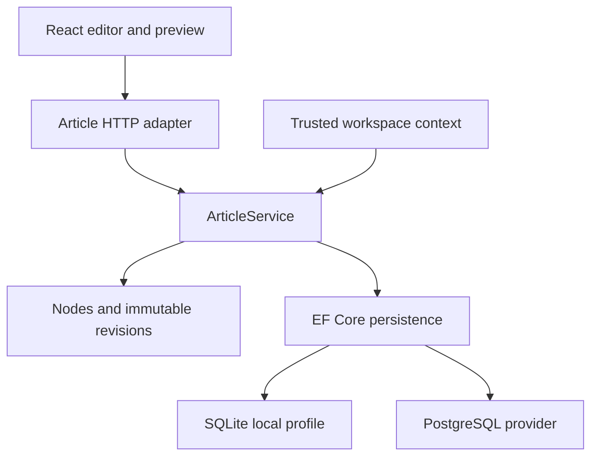

# Architecture

## System shape

The application is a feature-oriented modular monolith implemented with .NET 10 and ASP.NET Core. It
exposes the local Article application service through HTTP to a React web client. During development,
Vite serves the client and proxies HTTP requests. MCP and production client hosting are deferred.

The planned modules are:

- **Knowledge:** nodes, immutable revisions, relations, hierarchy, and history.
- **Workspaces:** workspace identity, membership, roles, and authorization.
- **Search:** full-text and semantic retrieval, ranking, and context assembly.
- **Consistency:** impact analysis, deterministic validation, semantic analysis, reports, and
  proposed changes.

Shared infrastructure currently provides relational persistence and health checks. AI providers,
hosted authentication, and background execution remain planned boundaries.

## Dependency rules

- Domain code owns invariants and depends on no delivery, database, or AI technology.
- Features coordinate use cases and may depend on explicit application-facing abstractions.
- HTTP and MCP adapters remain thin and reuse the same feature services.
- Infrastructure implements persistence, search, background, and provider integrations.
- Provider SDK types and SQL dialect details do not appear in Domain or public contracts.

Focused application services are preferred over mechanical one-handler-per-operation classes. A
workflow should become a dedicated component when it develops substantial rules, dependencies, or a
lifecycle of its own.

## Runtime profiles

The same application supports two persistence profiles:

- **Local:** single process, SQLite file, normally one automatically created personal workspace.
- **Server:** PostgreSQL persistence is implemented and tested; hosted authentication, multi-user
  deployment, `pgvector`, and optional `ltree` are planned. Article HTTP calls fail closed with `403`
  until the host supplies a trusted workspace resolver.

Both profiles preserve stable identifiers, revision behavior, workspace ownership, use cases, and
Article application contracts, with MCP planned as another adapter. Provider-specific capabilities
are explicit; local mode does not claim semantic vector search until an implementation is selected.

Local mode is not an offline replica of the server profile. Export/import is planned for initial
portability and is not yet implemented. Synchronization and cross-database conflict resolution
require a separate decision.

## Knowledge rules and planned extensions

- A knowledge node has stable identity; content edits create immutable revisions.
- The parent relationship is the portable hierarchy source of truth.
- Canonical semantic relations are stored structurally, not only as Markdown links.
- Workspace boundaries apply to nodes, revisions, relations, derived data, and traversal.
- AI consistency checks create reports, issues, and proposals rather than silently changing accepted
  knowledge.
- Embeddings and other derived artifacts identify the exact revision from which they were produced.

## Physical organization

Production code is under `src/`; .NET verification projects are under `tests/`. The server remains a
single primary application assembly initially. Module-internal `Domain`, `Features`, `Presentation`,
and `Infrastructure` folders should be added as real code requires them rather than as empty layers.

Accepted rationale is recorded in [ADR-0001](adr/0001-feature-oriented-modular-monolith.md).

