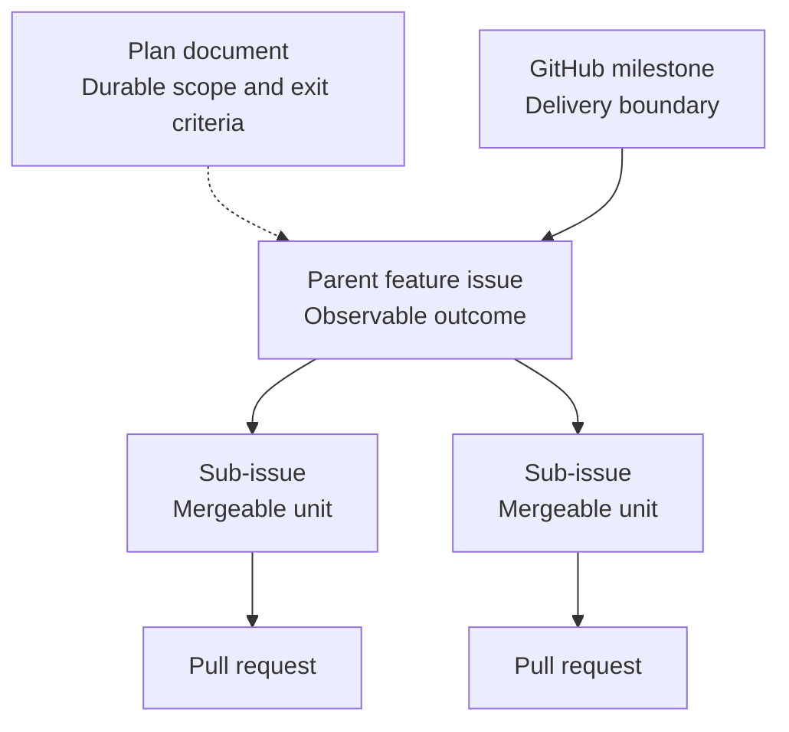
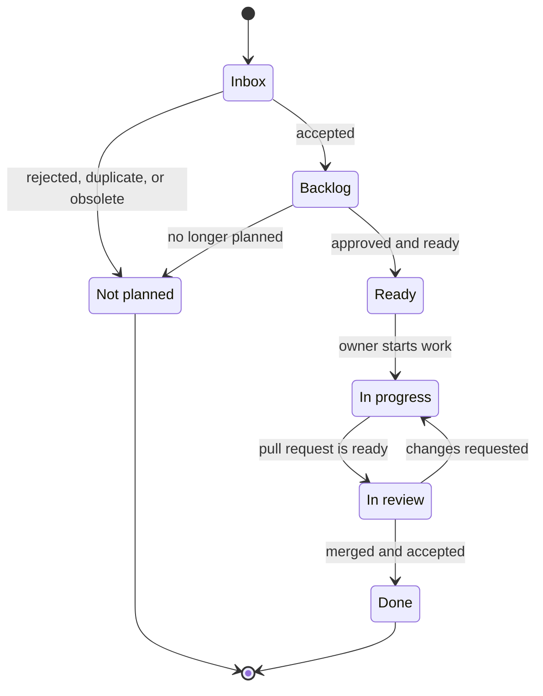

# Work Tracking and GitHub Issue Lifecycle

GitHub Issues are the source of truth for actionable work, ownership, priority, dependencies, and
delivery status. Repository documentation preserves the context and decisions that must remain
useful after an issue or pull request closes.

## Sources of truth

| Concern | Source of truth |
| --- | --- |
| Current priority, owner, status, and blockers | GitHub issue and project metadata |
| One independently deliverable unit of work | GitHub issue |
| Multi-issue outcome, scope, non-goals, risks, and exit criteria | Backlog or active plan |
| Accepted architectural decision and consequences | Architecture decision record |
| Current architecture, behavior, contract, schema, or operations | Living reference documentation |
| Implementation and review evidence | Pull request, tests, and CI |
| Completed or superseded implementation intent | Archived plan |

Do not copy live issue status or task ownership into a plan. A plan records only its coarse
lifecycle state—`Backlog`, `Active`, `Completed`, or `Superseded`—while GitHub tracks delivery
progress. A plan may still name the maintainer accountable for the initiative as a whole.

## Work hierarchy

Use the smallest hierarchy that makes ownership and progress clear:

1. A GitHub milestone represents a delivery boundary from the product roadmap.
2. A parent feature issue represents an observable user or system outcome.
3. Sub-issues represent independently assignable and mergeable units of work.
4. Pull requests implement one or more closely related issues.



Link the parent feature issue to its plan when one exists. Use native sub-issue and dependency
relationships rather than duplicating issue checklists in the plan. A small bug or enhancement that
fits in one pull request does not need a parent issue or plan.

## When a repository plan is required

Create or retain a plan when proposed work spans multiple issues or pull requests and at least one
of the following applies:

- it crosses application layers, modules, persistence providers, or public interfaces;
- sequencing, migration, security, or compatibility constraints need durable explanation;
- meaningful risks, non-goals, or milestone exit criteria must be agreed before implementation;
- future readers will need context that would be difficult to recover from closed issues.

Capture unshaped ideas, small enhancements, bugs, and maintenance work directly as GitHub issues.
The `docs/backlog/` directory is for shaped, multi-issue initiatives without an implementation
commitment; it is not a second task backlog.

## Issue lifecycle

Open issues move through these project statuses:

| Status | Meaning | Exit condition |
| --- | --- | --- |
| `Inbox` | Newly captured and not yet triaged | The issue is rejected, merged with another issue, or moved to `Backlog` |
| `Backlog` | Valid work that is not currently committed | It meets the readiness criteria and is approved for delivery |
| `Ready` | Approved, understood, and free of unresolved prerequisites | An owner begins implementation |
| `In progress` | An assignee is actively implementing the issue | A pull request is ready for review |
| `In review` | Implementation is under review and verification | The change is merged or returned for more work |
| `Done` | Acceptance criteria are satisfied and the implementation is merged | Terminal state |



Close rejected, duplicate, or obsolete issues as not planned and record a short reason. Do not move
them to `Done`, which means the requested outcome was delivered.

Use explicit issue dependencies for blocking relationships. A blocked issue retains the status that
best reflects its work state and is surfaced through its dependency metadata; avoid a separate
status label that can drift from the dependency graph.

## Issue types and metadata

Use the built-in `Feature`, `Bug`, and `Task` issue types when available, or equivalent `type:*`
labels. Use `Task` for implementation, documentation, maintenance, and time-boxed investigation that
does not itself deliver a user-facing feature.

Use area labels for stable ownership or filtering boundaries, initially:

```text
area:knowledge
area:workspaces
area:search
area:consistency
area:web
area:persistence
area:http
area:mcp
area:operations
```

Add risk labels such as `security`, `contract-change`, `migration`, and `decision-needed` only when
they change how the issue must be reviewed. Keep workflow status, priority, and size in project
fields rather than duplicating them as labels.

## Issue readiness

An issue is `Ready` when it has:

- a specific observable outcome;
- explicit scope and meaningful exclusions;
- verifiable acceptance criteria, including relevant failure and authorization behavior;
- links to its parent issue, plan, ADRs, and reference documentation where applicable;
- known dependencies and no unresolved prerequisite decision;
- identified testing, provider, public-contract, and documentation impact.

Acceptance criteria describe required behavior rather than prescribing an implementation. Record
implementation notes only when a constraint or previously accepted decision requires them.

## Starting and delivering work

- Assign one accountable owner before moving an issue to `In progress`.
- Create a task-specific branch from current `master` and link it to the issue when practical.
- Keep material scope changes in the issue so the agreed outcome remains reviewable.
- Link the pull request with a closing keyword such as `Closes #123` only when merging it will satisfy
  the issue completely.
- Keep partially delivered parent features open until their exit criteria and required sub-issues
  are complete.

An issue is done only when:

- every acceptance criterion is satisfied;
- proportionate automated and manual verification has passed;
- relevant living documentation and public-contract guidance are updated;
- durable architectural decisions are recorded in an ADR;
- the implementation is merged and no required follow-up remains hidden in review comments.

## Plan lifecycle integration

1. Capture and triage work in GitHub Issues.
2. For a shaped multi-issue initiative, add a `Backlog` plan under `docs/backlog/` and link it from a
   parent feature issue.
3. When the initiative is approved, move its plan to `docs/`, set it to `Active`, assign its issues
   to the appropriate GitHub milestone, and create only the sub-issues needed for the near-term work.
4. Track ownership, dependencies, and progress in GitHub; update the plan only when its durable
   scope, risks, sequencing constraints, or exit criteria change.
5. Transfer accepted outcomes from issue discussions into an ADR or living reference when they
   affect architecture, behavior, contracts, schema, operations, or security assumptions.
6. After all exit criteria pass, close the parent issue and milestone, mark the plan `Completed`, and
   move it to `docs/archive/` in the completing pull request.

Do not create issues for every bullet in a distant roadmap. Create actionable issues for the current
milestone and a small amount of shaped next work; leave later detail in its plan until implementation
approaches.
