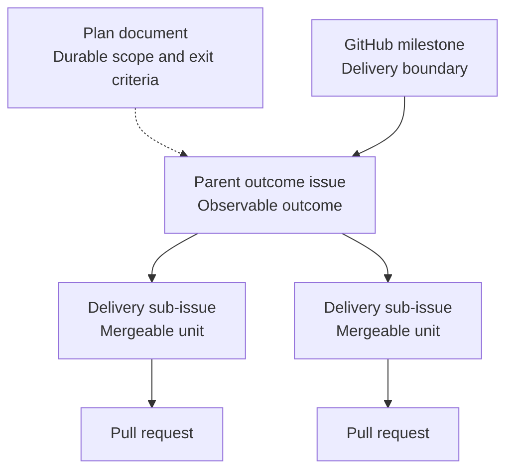
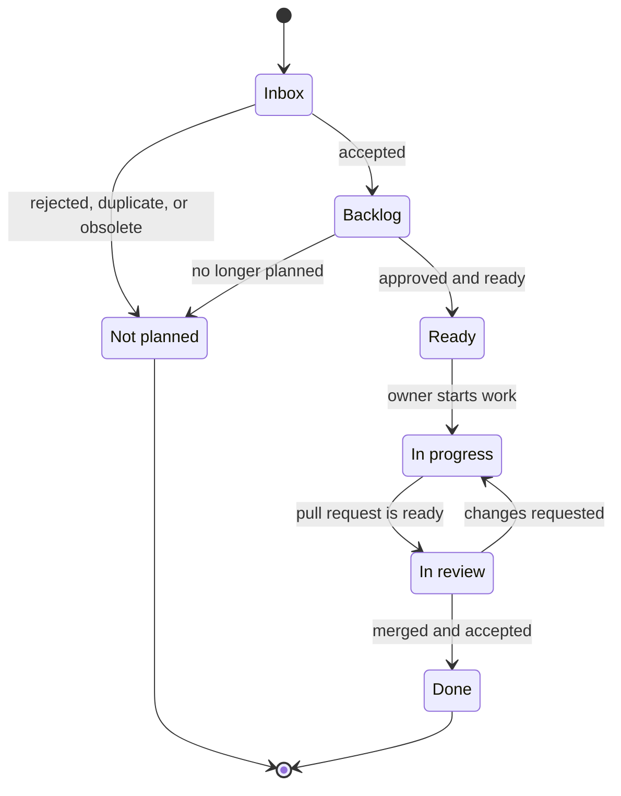

# Work Tracking and GitHub Issue Lifecycle

GitHub Issues are the source of truth for actionable work, ownership, priority, dependencies, and
delivery status. Repository documentation preserves the context and decisions that must remain
useful after an issue or pull request closes.

## Sources of truth

| Concern | Source of truth |
| --- | --- |
| Approved delivery boundary, target date, and issue membership | GitHub milestone |
| Current priority, owner, status, and blockers | GitHub issue and project metadata |
| One independently deliverable unit of work | GitHub issue |
| Multi-issue outcome, scope, non-goals, risks, and exit criteria | Backlog or active plan |
| Accepted architectural decision and consequences | Architecture decision record |
| Current architecture, behavior, contract, schema, or operations | Living reference documentation |
| Implementation and review evidence | Pull request, tests, and CI |
| Completed or superseded implementation intent | Archived plan |

Do not copy live issue status or task ownership into a plan. A plan records only its coarse
lifecycle state—`Backlog`, `Active`, `Completed`, or `Superseded`—while GitHub tracks delivery
progress. A plan may still name the maintainer accountable for the initiative as a whole.

## Work hierarchy

Use the smallest hierarchy that makes ownership and progress clear:

1. A GitHub milestone represents a delivery boundary from the product roadmap.
2. A parent outcome issue represents an observable user or system outcome spanning multiple deliveries.
3. Delivery issues represent independently assignable and mergeable units of work; attach them as
   native sub-issues when they contribute to a parent outcome.
4. Pull requests implement one or more closely related issues.



Link the parent outcome issue to its plan when one exists. Use native sub-issue and dependency
relationships rather than duplicating issue checklists in the plan. A small bug or enhancement that
fits in one pull request does not need a parent issue or plan.

`Parent outcome` and `delivery issue` describe roles, not additional GitHub issue types. A feature
or story that fits in one pull request can itself be a delivery issue. A parent outcome coordinates
its children and normally has no implementation branch of its own. Milestone membership and
parent/sub-issue relationships are separate: assign the milestone explicitly to each included issue.

## Milestone organization

Organize milestones around usable delivery outcomes or releases, such as reliable local navigation
or hosted multi-user access. Use area labels for technical categories such as persistence or HTTP;
do not create separate milestones for database, backend, frontend, and testing phases.

- Keep distant proposed milestones in the roadmap or backlog plans. Create a GitHub milestone when
  the delivery boundary is approved and its outcome, exclusions, and exit criteria are understood.
- Use a concise outcome-based name, following `Milestone N — Outcome` for the current roadmap. Its
  description summarizes the outcome and exclusions and links to the relevant plan. Set a due date
  only when there is a meaningful delivery target.
- A milestone may contain several parent outcomes and standalone delivery issues, bugs, or tasks.
  Create a parent only when coordination across multiple deliveries is needed; a milestone does not
  require an issue that merely repeats its name and contents.
- Assign all included parents and delivery children directly to the milestone. Do not rely on
  inheritance from a parent. Keep priority and individual ownership in issue/project metadata.
- Keep durable scope, risks, sequencing, and exit criteria in the relevant plan when the plan
  criteria below apply. Link the active plan to its GitHub milestone, parent outcomes, and roadmap;
  link the milestone and parents back to the plan. Do not copy live issue lists or progress into it.
- Treat GitHub's issue completion percentage as a count of closed issues, not a weighted measure of
  delivered value. Parents and their children both contribute to that count.

Review scope changes explicitly. Record accepted exclusions or deferrals in the affected issue and
plan, and update milestone membership and dependencies accordingly. Do not remove unfinished work
solely to make the milestone appear complete.

Close a delivered milestone only after all required work is merged, parent outcomes meet their exit
criteria, and milestone-level verification evidence is recorded. Closed children alone do not prove
the combined outcome. A dedicated verification issue is useful when integration, upgrade, or
cross-cutting evidence needs its own delivery; otherwise record that evidence in the parent issue
or completing pull request. Archive completed plans through the lifecycle below.

## Decomposing parent outcomes

Start a parent with the observable outcome, scope, non-goals, verifiable exit criteria, and links to
durable context. Use stable acceptance identifiers such as `AC-001` within that parent when work
spans children; reference them as `#123/AC-001` to avoid ambiguity between issues.

1. Inspect the plan, accepted decisions, existing implementation, and existing children before
   proposing new issues. Reuse or refine existing issues when they cover the intended result.
2. Identify prerequisite decisions. Separate a decision or investigation task when it produces a
   reviewable answer needed by later work; dependent implementation stays out of `Ready` until that
   prerequisite is resolved.
3. Split by independently verifiable capabilities or user flows. Prefer a slice that includes the
   domain/application behavior, persistence, transport, tests, and documentation that must change
   together. A backend capability with a stable tested contract can be delivered before its UI.
4. Check each proposed child against the execution criteria below. Split further when it contains
   unrelated outcomes or cannot be reviewed coherently; combine children that cannot be verified
   or merged independently after their prerequisites.
5. Map every parent acceptance criterion to its delivery children and expected evidence. Keep a
   compact mapping in the parent issue, for example `AC-001 → #124 → provider and HTTP tests`.
   This records coverage, not a second status checklist. Assign cross-cutting integration evidence
   explicitly, and ensure every child contributes to the parent outcome.
6. Create native sub-issue relationships and native blocking dependencies. Parent membership does
   not define execution order. Keep dependencies acyclic and assign the milestone to each child.
7. Recheck coverage and dependencies when scope changes or a child is split. Keep the parent open
   until its own criteria are verified and all required children are delivered.

Avoid mechanical issues such as "add entity", "add migration", and "add endpoint" for every
feature. These are usually implementation steps within one delivery issue. A layer-specific issue
is justified when it has a substantial, independently verifiable result, such as a data-preserving
provider migration or a shared contract that unblocks several capabilities. Include the tests and
documentation needed to accept that result in the same issue; final verification is not a reason
to postpone those checks.

For example, authorized workspace operations may span `area:workspaces`, `area:persistence`, and
`area:http` within one delivery. Workspace UI can follow as a separate delivery once the contract
is established. A larger UI issue can itself become a parent if workspace management and Article
tree navigation are independently reviewable outcomes; avoid extra hierarchy without that need.

## Delivery issues as execution units

A delivery issue is the default unit assigned to an implementation session. It has:

- one accountable owner and a bounded, observable result;
- enough linked context and constraints to proceed without unresolved prerequisite decisions;
- explicit acceptance criteria, including relevant failure, authorization, and compatibility cases;
- a coherent change that can normally be reviewed and merged in one task-specific branch and PR;
- proportionate tests and documentation sufficient to accept its own result.

An issue may span several agent sessions; session duration is not a reason to create sub-issues.
Record implementation steps in an issue checklist or session plan when useful. Promote a step to
a sub-issue only when separate assignment, review, or a prerequisite boundary warrants it. If work
grows into multiple independent deliveries, revise the issue into a parent and define children
before treating a partial PR as completion. Close a child only for its complete agreed outcome.

## When a repository plan is required

Create or retain a plan when proposed work spans multiple issues or pull requests and at least one
of the following applies:

- it crosses application layers, modules, persistence providers, or public interfaces;
- sequencing, migration, security, or compatibility constraints need durable explanation;
- meaningful risks, non-goals, or milestone exit criteria must be agreed before implementation;
- future readers will need context that would be difficult to recover from closed issues.

Capture unshaped ideas, small enhancements, bugs, and maintenance work directly as GitHub issues.
The `docs/backlog/` directory is for shaped, multi-issue initiatives without an implementation
commitment; it is not a second task backlog.

## Issue lifecycle

Open issues move through these project statuses:

| Status | Meaning | Exit condition |
| --- | --- | --- |
| `Inbox` | Newly captured and not yet triaged | The issue is rejected, merged with another issue, or moved to `Backlog` |
| `Backlog` | Valid work that is not currently committed | It meets the readiness criteria and is approved for delivery |
| `Ready` | Approved, understood, and free of unresolved prerequisites | An owner begins implementation |
| `In progress` | An assignee is actively implementing the issue | A pull request is ready for review |
| `In review` | Implementation is under review and verification | The change is merged or returned for more work |
| `Done` | Acceptance criteria are satisfied and the implementation is merged | Terminal state |



Close rejected, duplicate, or obsolete issues as not planned and record a short reason. Do not move
them to `Done`, which means the requested outcome was delivered.

Use explicit issue dependencies for blocking relationships. A blocked issue retains the status that
best reflects its work state and is surfaced through its dependency metadata; avoid a separate
status label that can drift from the dependency graph.

## Issue types and metadata

Use the built-in `Feature`, `Bug`, and `Task` issue types when available, or equivalent `type:*`
labels. Use `Task` for implementation, documentation, maintenance, and time-boxed investigation that
does not itself deliver a user-facing feature.

Choose the type by intent, regardless of parent or child role: `Feature` adds behavior, `Bug`
restores expected behavior, and `Task` delivers supporting work. Persistence, domain model, and API
are areas of change, not issue types. Apply multiple area labels when a delivery crosses boundaries;
use the owning module's label for domain behavior and `area:http` or `area:mcp` for API transports.

Use area labels for stable ownership or filtering boundaries, initially:

```text
area:knowledge
area:workspaces
area:search
area:consistency
area:web
area:persistence
area:http
area:mcp
area:operations
```

Add risk labels such as `security`, `contract-change`, `migration`, and `decision-needed` only when
they change how the issue must be reviewed. Keep workflow status, priority, and size in project
fields rather than duplicating them as labels.

## Issue readiness

Choose the issue form by its role:

- [Parent outcome](../.github/ISSUE_TEMPLATE/parent-outcome.yml) captures a result spanning multiple
  deliveries, its exit criteria, decomposition constraints, and acceptance coverage. Coverage may
  be filled after children are created; complete it before approving delivery.
- [Agent-ready work item](../.github/ISSUE_TEMPLATE/agent-ready-work-item.yml) captures one delivery,
  standalone or a sub-issue, with its PR boundary, parent criteria where applicable, verification,
  and documentation impact.

Forms allow incomplete proposals in `Inbox` or `Backlog`. Optional fields and unchecked readiness
items at creation do not waive readiness requirements. Complete applicable details before `Ready`;
for a parent, assess the agreed scope and decomposition, with prerequisites resolved for the next
delivery and explicit dependencies for later children. GitHub metadata remains the source of truth
for live tracking. Form text and checkboxes do not set issue types, area labels, milestones, status,
or native parent/dependency relationships; apply those separately.

An issue is `Ready` when it has:

- a specific observable outcome;
- explicit scope and meaningful exclusions;
- verifiable acceptance criteria, including relevant failure and authorization behavior;
- links to its parent issue, plan, ADRs, and reference documentation where applicable;
- known dependencies and no unresolved prerequisite decision;
- identified testing, provider, public-contract, and documentation impact.

Acceptance criteria describe required behavior rather than prescribing an implementation. Record
implementation notes only when a constraint or previously accepted decision requires them.

## Starting and delivering work

- Assign one accountable owner before moving an issue to `In progress`.
- Create a task-specific branch from current `master` and link it to the issue when practical.
- Keep material scope changes in the issue so the agreed outcome remains reviewable.
- Link the pull request with a closing keyword such as `Closes #123` only when merging it will satisfy
  the issue completely.
- Keep partially delivered parent outcomes open until their exit criteria and required sub-issues
  are complete.

An issue is done only when:

- every acceptance criterion is satisfied;
- proportionate automated and manual verification has passed;
- relevant living documentation and public-contract guidance are updated;
- durable architectural decisions are recorded in an ADR;
- the implementation is merged and no required follow-up remains hidden in review comments.

## Plan lifecycle integration

1. Capture and triage work in GitHub Issues.
2. For a shaped multi-issue initiative, add a `Backlog` plan under `docs/backlog/` and link it from a
   parent outcome issue.
3. When the initiative is approved, move its plan to `docs/`, set it to `Active`, assign its issues
   to the appropriate GitHub milestone, and create only the sub-issues needed for the near-term work.
4. Track ownership, dependencies, and progress in GitHub; update the plan only when its durable
   scope, risks, sequencing constraints, or exit criteria change.
5. Transfer accepted outcomes from issue discussions into an ADR or living reference when they
   affect architecture, behavior, contracts, schema, operations, or security assumptions.
6. In the completing pull request, record exit evidence, mark the delivered plan `Completed`, and
   move it to `docs/archive/` with links to the parent outcome and completing pull request. After
   merge, close the satisfied parent outcomes. Close the milestone only when every required outcome
   and its milestone-level verification are complete; one archived plan need not complete a whole
   milestone.

Do not create issues for every bullet in a distant roadmap. Create actionable issues for the current
milestone and a small amount of shaped next work; leave later detail in its plan until implementation
approaches.
